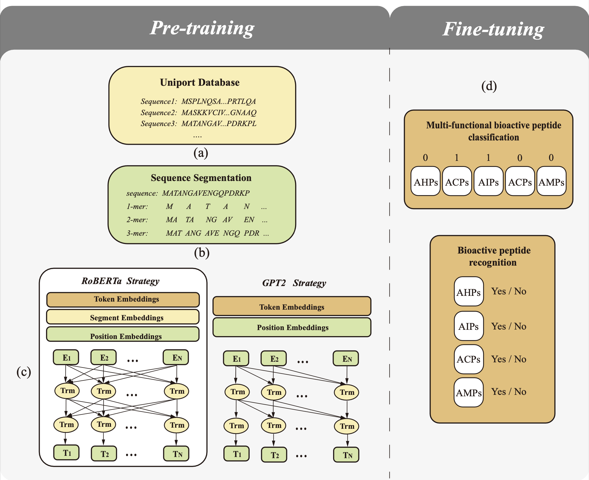

# Bioactive peptide recognition based on NLP pre-train algorithm


For experimental details please refer to [our paper](https://ieeexplore.ieee.org/abstract/document/9529198), and the code is adapted from [UER](https://github.com/dbiir/UER-py).
<p align="center"></p>
<br/>

## Abstract
Bioactive peptides classification is an important problem in Bioinformatics. Biologists mostly use an experimental method to recognize bioactive peptides, which is a tedious and time-consuming task. With the development of machine learning, more and more computational methods were proposed to solve this problem. But the effect of most computational models is limited by the small sample size. Inspired by the success of sequence classification in natural language processing with unlabeled data, we proposed a pre-training based method for Bioactive peptides recognition. By pre-trained with large-scale of protein sequences, our method achieved the best performance in multiple functional peptides identification including anti-cancer, anti-diabetic, anti-hypertensive, anti-inflammatory and anti-microbial peptides. Compared with the advanced model, our model’s precision, coverage, accuracy and absolute true are improved by 0.72%, 0.69%, 0.59% and 0.42% in the result of 5-fold cross-validation. In addition, in single functional peptides recognition, we also achieve  better performance in the ACPs and AMPs which with longer sequences.
<br/><br/>

## Data & Models
Available at this address (<a href="https://pan.baidu.com/s/1t0dMwbBqYSEmK1Hr9SqVPg">https://pan.baidu.com/s/1t0dMwbBqYSEmK1Hr9SqVPg)

The password is bhmv

Then unzip these zips and put them on the root of the project.
<br/><br/>

## How to Run
#### Example:
Multi-functional BP prediction on RoBERTa 
```
sh classify_roberata.sh
```
Multi-functional BP prediction on GPT2 
```
sh classify_gpt2.sh
```
Single functional BP recognition
```
sh classify_roberta_binary.sh
```
<br/>

## Requirements
- torch>=1.1
- argparse
- six>=1.12.0
- packaging
- numpy
<br/><br/>